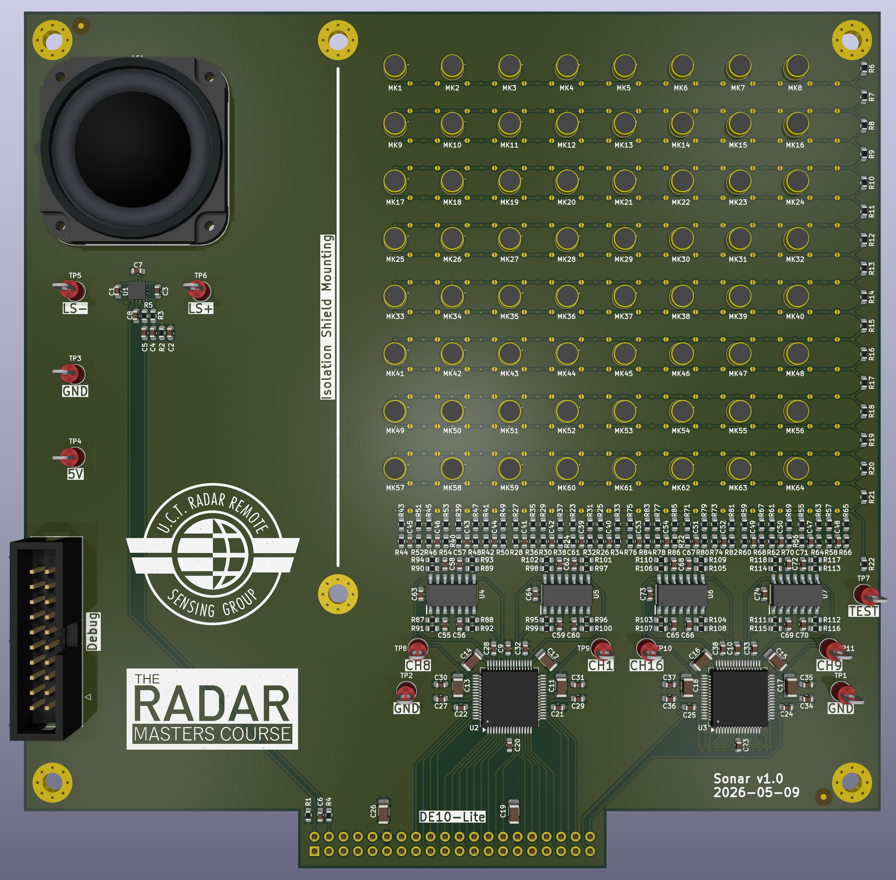
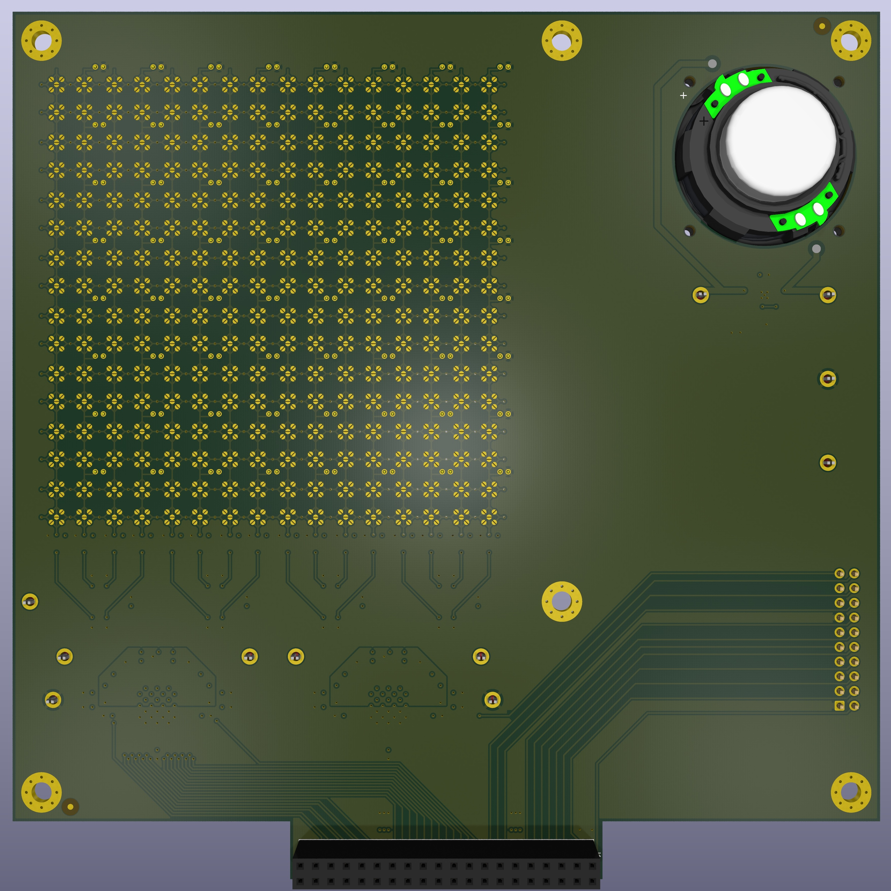

# Sonar

Project used as a teaching aid for the UCT FPGA course

## Overview

This DE10-Lite daughter card features transmitter and receiver array for a 10 kHz sonar system.

## Flexible Grid

The design features a 64-element grid of microphone sites and a connection matrix that supports 16 output channels.  The user can populate up to 16 microphones and then use the matrix to route them to the receiver channels.

